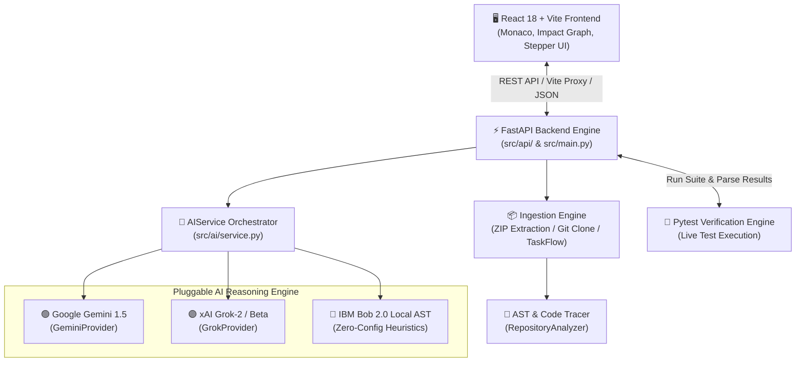

<div align="center">

# ⚡ CodePilot

### **AI-Powered Autonomous Debugging & Repository Investigation Platform**
*Powered by IBM Bob 2.0, Google Gemini 1.5, and xAI Grok*

[](https://fastapi.tiangolo.com)
[](https://react.dev)
[](https://www.typescriptlang.org/)
[](https://vitejs.dev/)
[](https://tailwindcss.com/)
[](https://www.python.org/)
[](https://docs.pytest.org/)
[](LICENSE)

<br/>

> **"AI Proposes. Evidence Proves. Humans Decide."**
> 
> **CodePilot** bridges the gap between AI code generation and deterministic software quality. It autonomously ingests repositories, traces multi-layer AST paths, formulates surgical patches, synthesizes regression tests, and proves correctness through live test runner verification.

<br/>

[🚀 Quickstart](#-quickstart-run-on-local-pc) • [🧠 AI Providers](#-multi-ai-provider-engine) • [🏗 Architecture](#-system-architecture) • [🔍 Verified Bug Scenarios](#-demonstrated-bug-scenarios-taskflow-api) • [📡 API Reference](#-api-endpoint-reference)

---
</div>

<br/>

## 🌟 Highlights & Key Innovations

| Feature | Description |
| :--- | :--- |
| **🧠 Multi-AI Provider Switching** | Seamlessly swap between **Google Gemini 1.5**, **xAI Grok**, and **IBM Bob 2.0 Local AST Engine** with zero code changes. |
| **🔍 Multi-Layer AST Tracing** | Traces execution paths across API routes (`FastAPI`), domain logic (`Services`), and data models (`Pydantic`) to pin point root causes. |
| **⚡ Live Monaco Diff & Code Viewer** | Side-by-side interactive code diffs with line-by-line syntax highlighting and *"Why this change?"* structural rationale. |
| **🛡 Human-in-the-Loop Verification Gate** | Strictly isolated fix proposals requiring developer inspection and approval prior to committing file patches. |
| **🕸 Dynamic Impact Topology Graph** | Visual rendering of affected endpoints, helper functions, database schemas, and unit test suites. |
| **📦 Universal Ingestion** | Drag-and-drop `.zip` archive extraction, GitHub repository shallow-cloning, or instant built-in TaskFlow testbed loading. |
| **🧪 Automated Pytest Execution** | Executes live regression suites directly against the workspace, proving 100% bug fix verification. |
| **⌨️ Command Palette (`⌘K` / `Ctrl+K`)** | Keyboard-first navigation across active investigations, repositories, and diagnostic tools. |

---

## 🏗 System Architecture

CodePilot operates as a decoupled, asynchronous multi-tier architecture connecting a React 18 TypeScript frontend to a FastAPI Python backend and pluggable AI providers.

### 🌐 End-to-End Control & Data Flow



---

## 🧠 Multi-AI Provider Engine

CodePilot features a unified, pluggable AI provider abstraction layer located in `src/ai/`:

```text
                               ┌────────────────────────────────┐
                               │   AIService (src/ai/service)   │
                               └───────────────┬────────────────┘
                                               │
               ┌───────────────────────────────┼───────────────────────────────┐
               ▼                               ▼                               ▼
  ┌─────────────────────────┐     ┌─────────────────────────┐     ┌─────────────────────────┐
  │   Google Gemini 1.5     │     │     xAI Grok Provider   │     │    IBM Bob 2.0 Local    │
  │ (gemini-1.5-flash/pro)  │     │  (grok-2-latest/beta)   │     │  (Offline AST Heuristic)│
  └─────────────────────────┘     └─────────────────────────┘     └─────────────────────────┘
```

### 1. 🟢 Google Gemini (`gemini-1.5-flash` & `gemini-1.5-pro`)
- Performs deep multi-file AST context analysis and structured JSON fix formulation.
- Generates precise line-number target ranges and minimal drop-in replacement chunks.

### 2. 🟣 xAI Grok (`grok-2-latest` & `grok-beta`)
- Specializes in defect hypothesis generation, cross-layer dependency mapping, and regression test assertion synthesis.

### 3. 🔵 IBM Bob 2.0 Local AST Engine
- Zero-config, offline-ready local heuristic engine that operates without external API keys.
- Ideal for air-gapped security environments, offline hackathon presentations, and rapid local evaluation.

---

## 🔍 Demonstrated Bug Scenarios (TaskFlow API)

CodePilot includes three built-in benchmark bug investigations targetting real-world logic bugs in the `TaskFlow` backend service:

```
┌──────────────────────────────────────────────────────────────────────────────────┐
│                             TaskFlow Bug Scenarios                               │
├─────────┬───────────────────────────────┬──────────────────────────────┬─────────┤
│ ID      │ Scenario Name                 │ Affected Source File         │ Status  │
├─────────┼───────────────────────────────┼──────────────────────────────┼─────────┤
│ INV-001 │ Incorrect Progress Percentage │ src/services/project_service │ VERIFIED│
│ INV-002 │ Task Status Not Persisting    │ src/services/task_service.py │ VERIFIED│
│ INV-003 │ Inverted Filter Arguments     │ src/api/tasks.py             │ VERIFIED│
└─────────┴───────────────────────────────┴──────────────────────────────┴─────────┘
```

### 🐞 1. Incorrect Project Progress Calculation (`INV-001`)
* **File Location**: `src/services/project_service.py:42`
* **Root Cause Defect**: Condition `t.status != TaskStatus.DONE` inverted the progress metric, reporting incomplete tasks instead of completed ones.
* **Surgical Fix**:
  ```diff
  - completed = sum(1 for t in tasks if t.status != TaskStatus.DONE)
  + completed = sum(1 for t in tasks if t.status == TaskStatus.DONE)
  ```
* **Verified Regression Tests**: `test_progress_with_mixed_task_states`, `test_progress_with_no_completed_tasks`, `test_progress_with_all_completed_tasks`.

---

### 🐞 2. Task Status Update Not Persisting (`INV-002`)
* **File Location**: `src/services/task_service.py:73`
* **Root Cause Defect**: Function returned the task object without updating `task.status = status`, silently discarding status transitions.
* **Surgical Fix**:
  ```diff
  + task.status = status
    task.updated_at = datetime.utcnow()
    return self.repository.update(task)
  ```
* **Verified Regression Tests**: `test_update_task_status_done`, `test_status_update_preserves_assignee`.

---

### 🐞 3. Task Filter Arguments Swapped (`INV-003`)
* **File Location**: `src/api/tasks.py:34`
* **Root Cause Defect**: Query parameters `status` and `assignee_id` were passed in inverted positional order to the repository filter function.
* **Surgical Fix**:
  ```diff
  - return task_service.filter_tasks(assignee_id, status)
  + return task_service.filter_tasks(status=status, assignee_id=assignee_id)
  ```
* **Verified Regression Tests**: `test_list_tasks_by_status`, `test_list_tasks_by_assignee`.

---

## ⚡ Quickstart (Run on Local PC)

### 1. Prerequisites
- **Python**: `3.10+` (e.g. Python 3.11 / 3.12 / 3.13)
- **Node.js**: `v18+` or `v20+` (npm included)
- **Git**

### 2. Clone the Repository
```bash
git clone https://github.com/Patelprincekumar2007/CodePilot-IBM-Bob-New.git CodePilot-IBM-Bob
cd CodePilot-IBM-Bob
```

### 3. Backend Setup & Run (FastAPI)
```bash
# Create and activate Python virtual environment
python -m venv venv
# On Windows:
venv\Scripts\activate
# On Linux / macOS:
source venv/bin/activate

# Install backend dependencies
pip install -r requirements.txt

# (Optional) Create .env file for AI provider keys
cp .env.example .env

# Start FastAPI Backend Server
python -m uvicorn src.main:app --reload --port 8000
```
> 🌐 Backend API is live at **[http://localhost:8000](http://localhost:8000)** (Swagger UI at **[http://localhost:8000/docs](http://localhost:8000/docs)**).

---

### 4. Frontend Setup & Run (React 18 + Vite + TypeScript)
In a second terminal window:
```bash
cd frontend

# Install Node dependencies
npm install

# Start Vite Development Server
npm run dev
```
> 🌐 Frontend UI is live at **[http://localhost:3000](http://localhost:3000)**.

---

### 5. Running Automated Pytest Verification
```bash
# From workspace root with venv activated:
pytest
```
```text
============================= test session starts ==============================
platform win32 -- Python 3.13.0, pytest-9.1.1
collected 41 items

tests/test_analysis.py .................                                [ 41%]
tests/test_api.py .................                                      [ 82%]
tests/test_progress.py ........                                         [100%]

============================== 41 passed in 1.24s ==============================
```

---

## 📂 Project Directory Structure

```text
CodePilot-IBM-Bob/
├── frontend/                     # React 18 + Vite + TypeScript + Tailwind UI
│   ├── src/
│   │   ├── api/                  # Axios & Fetch Clients (Repos, Investigations, Tests)
│   │   ├── components/
│   │   │   ├── code/             # MonacoCodeViewer, MonacoDiffViewer, FileTreeExplorer
│   │   │   ├── dashboard/        # IssueComposer, DemoScenarioSelector, SystemMetrics
│   │   │   ├── investigation/    # Stepper, FindingCard, ImpactGraph, ApprovalPanel
│   │   │   ├── layout/           # AppShell, Topbar, Sidebar, CommandPalette (⌘K)
│   │   │   ├── review/           # Interactive ImpactGraph, Code Review Checklists
│   │   │   └── tests/            # TestRunCard, Regression Test Assertions
│   │   └── pages/                # Workspace pages (Dashboard, Repos, Investigations, Settings)
│   ├── package.json              # Frontend package configuration (includes rollup WASM override)
│   └── vite.config.ts            # Vite dev server configuration (Port 3000, Proxy -> 8000)
├── src/                          # FastAPI Backend Engine
│   ├── ai/                       # GeminiProvider, GrokProvider, IBM Bob Provider, AIService
│   ├── analysis/                 # RepositoryAnalyzer (AST Parser, Language/Framework Tracer)
│   ├── api/                      # FastAPI Routers (Repositories, Investigations, Tasks, Projects)
│   ├── services/                 # Ingestion Engine, Project Service, Task Service
│   └── main.py                   # FastAPI Application Entrypoint
├── tests/                        # Pytest Test Suite (41 unit & integration tests)
├── data/                         # Synthetic Bug Dataset & Json Schemas
├── docs/                         # Architecture Contracts & API Specifications
└── README.md                     # Project Documentation
```

---

## 📡 API Endpoint Reference

| Method | Endpoint | Description |
| :--- | :--- | :--- |
| `GET` | `/health` | Backend service health and status indicator |
| `GET` | `/api/investigations` | List all investigation records and fix histories |
| `POST` | `/api/investigations` | Trigger a new autonomous AI investigation |
| `GET` | `/api/investigations/{id}` | Retrieve detailed AST finding, diff, and evidence |
| `POST` | `/api/investigations/{id}/approve` | Apply approved surgical fix patch to codebase |
| `POST` | `/api/repositories/upload-zip` | Upload and extract repository `.zip` archive |
| `POST` | `/api/repositories/ingest-git` | Shallow-clone public or private Git repository |
| `POST` | `/api/tests/run` | Execute live Pytest suite and return structured results |

---

## 🤝 Contributing & License

CodePilot is released under the **MIT License**. Contributions, bug reports, and feature proposals are welcome!

1. Fork the repository
2. Create your feature branch (`git checkout -b feature/amazing-feature`)
3. Commit your changes (`git commit -m 'feat: add amazing feature'`)
4. Push to the branch (`git push origin feature/amazing-feature`)
5. Open a Pull Request

---

<div align="center">
  <sub>Built with ❤️ by team CodePilot for Hackathons & AI Autonomous Software Development.</sub>
</div>
